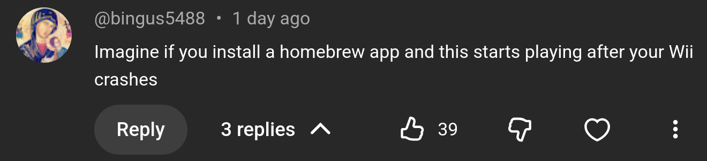

# Third Sanctuarii

Third Sanctuary but your actual Wii crashed.  
"Suggested" by bingus5488 under "Third Sanctuary but your Wii crashed". [(Take a listen!)](https://www.youtube.com/watch?v=KZVGO7VLX_0)

## Feature
- Plays audio from "Third Sanctuary but your Wii crashed"
- Renders image of Wii in Deltarune prophecy style
- Actually crashes your Wii

Press any button to get started.  
Press HOME to quit the app before your Wii crashes.

## Performance
This Homebrew app is a joke, and is NOT OPTIMIZED in the slightest.
I didn't actually bother to learn how to use the GX system.
Everything is rendered with a single thread writing directly into the frame buffer.
Dolphin runs it at about 15 FPS.